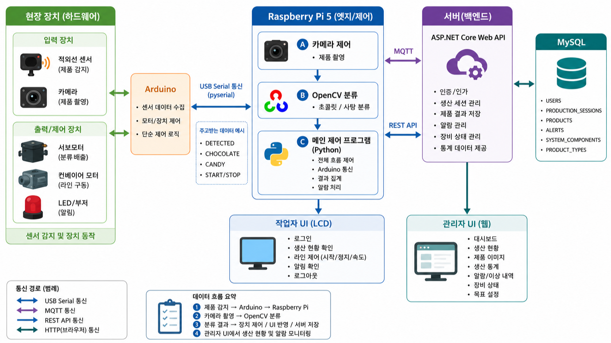

# Smart Sorting Server

컨베이어 기반 초콜릿·사탕 자동 분류 시스템의 **ASP.NET Core Web API 서버 및 MySQL 데이터베이스 프로젝트**입니다.

적외선 센서가 제품 투입을 감지하면 카메라가 이미지를 촬영하고, OpenCV 기반 분류 모듈이 초콜릿과 사탕을 판별합니다. 서버는 생산 작업, 제품별 감지·분류 결과, 시스템 구성요소 상태, 알림 및 오류 이력을 통합 관리합니다.

---

## 시스템 구성



적외선 센서가 제품 투입을 감지하면 Arduino가 감지 정보를 Raspberry Pi로 전달합니다. Raspberry Pi는 카메라 촬영과 OpenCV 분류를 수행하고, 분류 결과를 기반으로 장치를 제어하며 작업자 UI에 생산 현황을 반영합니다.

ASP.NET Core Web API는 생산 작업, 제품 감지 결과, 알림, 시스템 구성요소 상태를 관리하고 MySQL에 저장합니다. 관리자 웹은 서버 API를 통해 생산 현황과 알림·장비 상태를 조회합니다.

## 제품 관리 기준

| 제품 | 관리 기준 |
|---|---|
| 초콜릿 | 10개 = 1세트 |
| 사탕 | 1개 = 1세트 |

---

## 기술 스택

| 구분 | 기술 |
|---|---|
| Language | C# |
| Backend | ASP.NET Core Web API |
| ORM | Entity Framework Core |
| Database | MySQL |
| Messaging | MQTT |
| Authentication | JWT |
| Password Security | BCrypt |

---

## 주요 기능

- 사용자 로그인 및 역할 관리
- 생산 작업 생성 및 상태 관리
- 제품 감지·분류 결과 저장
- 초콜릿·사탕 생산량 집계
- 시스템 구성요소 현재 상태 관리
- 알림 발생·복구·확인 이력 관리
- 작업자 화면 및 관리자 대시보드용 API 제공

---

## 현재 진행 상태

### 완료

- MySQL 데이터베이스 스키마 설계
- 6개 테이블 및 관계 정의
- PK, FK, UNIQUE, NULL, CHECK 제약조건 작성
- 제품 유형 및 시스템 구성요소 초기 데이터 작성
- 테스트용 더미 데이터 작성
- DBeaver 편집용 ERD 작성
- ERDCloud 문서용 ERD 작성

### 예정

- ASP.NET Core Web API 프로젝트 구성
- Entity Framework Core 모델 및 DbContext 작성
- JWT 로그인 및 역할 기반 권한 처리
- BCrypt 비밀번호 해시 적용
- 생산 작업·분류 결과·장비 상태·알림 API 구현
- MQTT 메시지 수신 및 장비 연동
- 관리자 대시보드용 통계 API 구현

---

## 문서

- [데이터베이스 설계 문서](database/DATABASE_DESIGN.md)
- [개발 및 설계 진행 기록](docs/DEVELOPMENT_LOG.md)

---

## 프로젝트 구조

```text
smart-sorting-server/
├─ database/
│  ├─ DATABASE_DESIGN.md
│  └─ smart_sorting_system.sql
├─ docs/
│  ├─ DEVELOPMENT_LOG.md
│  ├─ smart_sorting_system.erd
│  └─ smart_sorting_system_erd.png
├─ src/
└─ README.md
```

- `smart_sorting_system.sql`: 데이터베이스 생성, 제약조건, 초기·더미 데이터
- `smart_sorting_system.erd`: DBeaver에서 열고 수정하는 편집용 ERD
- `smart_sorting_system_erd.png`: GitHub에서 바로 확인하는 ERD 이미지
